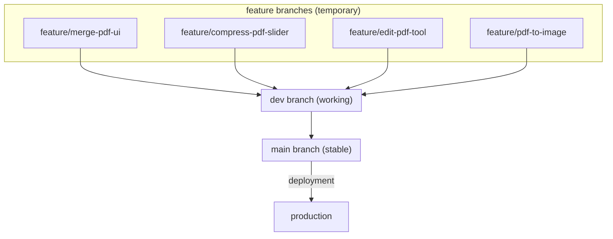

# Git Branch Workflow – FILEKIT

This file explains, in simple words, **when to use `main`, `dev`, and feature branches**, and which branch you should be on when adding new features.

---

## 🧠 What are branches?

Think of branches like versions of your project:

- **`main` branch = main trunk**
  - Always stable
  - This is the version you “trust”
  - Later: production / live website will use this

- **`dev` branch = working copy**
  - You build and test new things here
  - Can be a bit messy, but should still run
  - All new features go here first (through feature branches)

- **`feature/*` branches = small branches off `dev`**
  - Each one is for **one feature or fix**
  - Safe place to experiment
  - When done → merged back into `dev`

---

## 🌳 Why use `main` + `dev` + `feature/*`?

### `main`
- Clean, stable “good version”
- No half-done features
- Used for releases / deployments

### `dev`
- Where you actually combine and test new features
- You run the app from here to see if everything works together

### `feature/...`
- Used when you start a **new feature or tool**
- You don’t break `dev` while experimenting
- You can delete it later if you don’t like the change

---

## 👀 How to check which branch you’re on

In the terminal, run:

```bash
git status


One-time setup: create dev branch

Do this once in the root project folder (FILEKIT):

# make sure you're on main first
git status          # check current branch
git checkout main   # switch to main just in case

# create dev from main and switch into it
git checkout -b dev

# push dev branch to GitHub and track it
git push -u origin dev


Now the repo has two main branches:

main
dev


🔁 Daily workflow – when to use which branch
✅ 1. Where do I work most of the time?

You normally work on dev and feature branches, not on main.

1️⃣ Before you start working (every coding session)

Every time you open VS Code to work:

cd FILEKIT

git status          # see current branch and changes
git checkout dev    # move to dev branch
git pull            # get latest updates for dev


Now you’re on dev and up to date.

2️⃣ When you start a new feature

Examples of new features:

Add Compress PDF slider

Add Edit PDF UI

Add Repair PDF tool

Add PDF → JPG converter

Always create a feature branch from dev:

git checkout dev
git pull                             # just to be safe
git checkout -b feature/<short-name>


Examples:

git checkout -b feature/merge-pdf-ui
git checkout -b feature/compress-pdf-backend
git checkout -b feature/edit-pdf-add-text-tool


You can confirm with:

git status   # should show: On branch feature/merge-pdf-ui


From this point, you code normally on this feature/... branch.

3️⃣ While coding on a feature branch

Do your changes in frontend/ or backend/ (or both).

When you finish a small chunk that works:

git status
git add .
git commit -m "feat(frontend): add basic edit pdf canvas"
git push -u origin feature/<short-name>


You can repeat:

code

git add .

git commit -m "..."

git push

All on the same feature/... branch until the feature is ready.

4️⃣ When the feature is ready (merge back into dev)

You tested the feature on your machine and it seems OK.

Now you want dev to include this feature:

# go back to dev
git checkout dev
git pull                    # update dev first

# merge feature branch into dev
git merge feature/<short-name>

# push updated dev to GitHub
git push


Now dev has your new feature.

You can clean up by deleting the feature branch (optional but nice):

git branch -d feature/<short-name>             # delete locally
git push origin --delete feature/<short-name>  # delete from GitHub

5️⃣ When dev is stable and you want main updated

You’ve finished a few features, tested them, and you’re happy.
Now you want main to get everything from dev.

git checkout main
git pull                 # get latest main
git merge dev            # bring all changes from dev into main
git push                 # update main on GitHub


Now:

main = latest stable, tested code

dev = continues to be your working branch

future deployment / live website should use main


These are NOT permanent.

You work on them:

➡ When starting a new feature:

git checkout dev
git pull
git checkout -b feature/<name>


➡ After the feature is finished:

git checkout dev
git merge feature/<name>
git push


➡ Then you delete the feature branch:

git branch -d feature/<name>
git push origin --delete feature/<name>


# FILEKIT Git Branch Flow Diagram

This diagram shows how branches flow in the FILEKIT project.

```
                  ┌──────────────────────────┐
                  │        production         │
                  │        (deployed)         │
                  └─────────────▲────────────┘
                                │
                            merge dev → main
                                │
                    ┌───────────┴───────────┐
                    │       MAIN BRANCH     │
                    │   (stable final code) │
                    └───────────┬───────────┘
                                │
                                │
                         merge feature → dev
                                │
                    ┌───────────┴───────────┐
                    │        DEV BRANCH     │
                    │   (daily working branch)
                    │   test features here   │
                    └───────────┬───────────┘
                                │
                                │  create from dev
                                ▼
         ┌──────────────────────────────────────────────────────┐
         │                   FEATURE BRANCHES                   │
         │  (one branch per feature/tool; temporary branches)   │
         ├──────────────────────────────────────────────────────┤
         │  feature/merge-pdf-ui                                │
         │  feature/compress-pdf-slider                         │
         │  feature/edit-pdf-text-tool                          │
         │  feature/split-pdf-backend                           │
         │  feature/pdf-to-image-convert                        │
         │  feature/image-resize-tool                           │
         └──────────────────────────────────────────────────────┘

 Feature branches → merge into dev
 Dev → merge into main when stable
 Main → used for production deployment
```

---

# ⭐ OPTIONAL: Mermaid Diagram (if you use markdown preview)

This version creates a nice **graph visualization** in VS Code when using Markdown Preview or GitHub:

````markdown
# FILEKIT Git Branch Flow (Mermaid Diagram)




